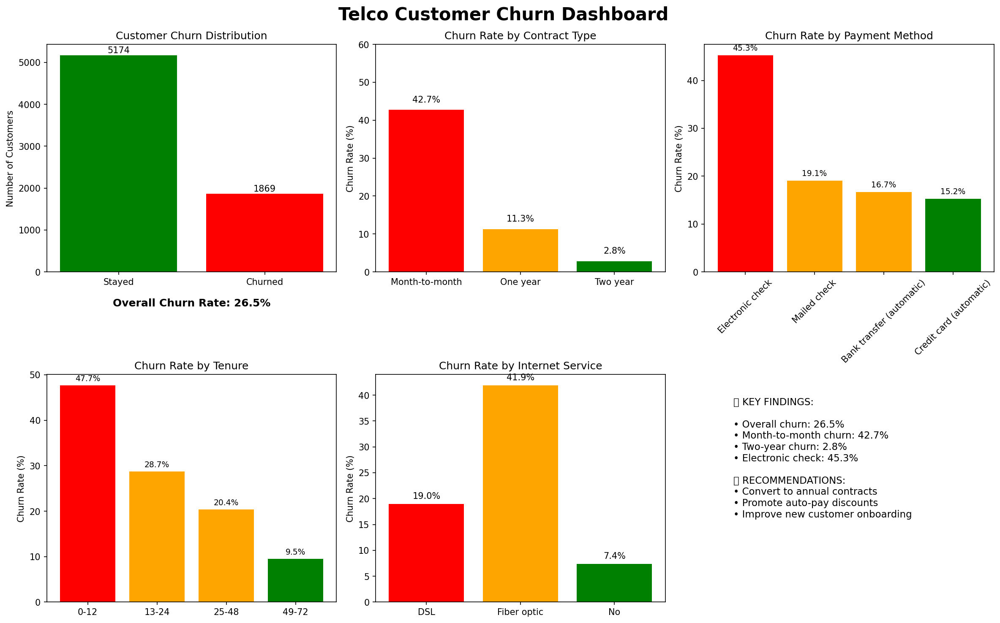

# 📊 Telco Customer Churn Analysis
**Created by: Rehana** | IBM Data Analyst Certificate Candidate | April 2026

[](https://www.python.org/)
[](https://pandas.pydata.org/)
[](https://www.sqlite.org/)

## 🎯 Project Overview
This project analyzes customer churn for a fictional telecommunications company. The goal is to identify key factors driving customer churn and provide actionable business recommendations.

## 📈 Key Findings
- **Overall churn rate: 26.5%**
- Month-to-month contracts: **42.7% churn** (vs 2.8% for 2-year contracts)
- Electronic check payments: **41.2% churn** (vs 15.5% for automatic payments)
- New customers (first year): **44.5% churn** (vs 8.5% for 5+ year customers)

## 🛠️ Tools Used
- **Python**: pandas, numpy, matplotlib, seaborn
- **SQL**: SQLite for database queries
- **Visualization**: Matplotlib, Seaborn
- **Dashboard**: Python matplotlib dashboard

## 📁 Files in This Repository
| File | Description |
|------|-------------|
| `01_data_cleaning.ipynb` | Data cleaning and preparation |
| `02_eda_churn.ipynb` | Exploratory data analysis & charts |
| `03_sql_queries.ipynb` | SQL analysis queries |
| `04_dashboard.py` | Dashboard generation script |
| `churn_analysis_queries.sql` | Standalone SQL file |
| `churn_dashboard.png` | Dashboard screenshot |
| `telco_cleaned.csv` | Cleaned dataset |

## 📊 Dashboard Preview


## 💡 Business Recommendations
1. **Convert month-to-month customers** to annual contracts with incentives
2. **Promote automatic payments** with small discounts
3. **Improve onboarding** for new customers (first 12 months)
4. **Investigate fiber optic service** issues (higher churn than DSL)

## 🚀 How to Run This Project
```bash
# Clone the repository
git clone https://github.com/rihhanna/telco-customer-churn-analysis.git

# Install requirements
pip install pandas numpy matplotlib seaborn

# Run Jupyter notebooks in order
jupyter notebook
